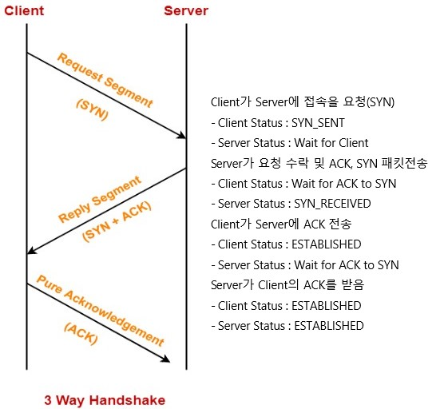

#Data Base Connection Pool 정리

###TCP
    -Transmission Control Protocol의 약어
    -클라이언트와 서버간에 데이터를 신뢰성 있게 전달하기 위한 프로토콜
    -데이터 전송을 위해 사전 연결을 만들기 위한 연결 지향 프로토콜
    -네트워크 데이터 전달 과정 중 주객전도, 손실 될 경우 순서 재조합과 교정 가능 

###TCP 3-way Handshake Process
    -안전하고 신뢰할 수 있는 통신 링크를 작성하며 TCP에서 실행되는 미리 정의된 단계
    -연결 설정 및 연결 해제 또한 3-way handshake 프로세스를 수행
    -SYN : Synchronize Sequence Numbers(동기화순번)
    -ACK : acknowledgment(승인)

###TCP 수행 과정

###Connection Pool
    클라이언트의 요청(쿼리)에 앞서 TCP 3-way Handshake가 선행되어 데이터의 입출력을 행하는데
    지속적인 요청에 3-way Handshake가 반복적으로 실행되면 네트워크 구간의 성능이 제한 될 수 있다
    MYSQL 기준 쿼리 수행시 가장 많은 비용이 Connecting에서 발생된다고 한다
    이 문제를 해결하기 위해 Connection pool방식을 도입하여 반복적인 3way-Handshaking을 제거하여
    기존 클라이언트의 요청을 빠르게 통신 할 수 있게되며 비용을 절감한다
    정리하면 반복적인 Connection으로 인한 비싼 비용을 Connection Pool로 절감한다

###Thread Get Connection (Hikari CP 기준)
    클라이언트의 요청으로 인한 Thread가 Connection Pool에 Connection을 요청한다
    1.Thread가 사용했던 Connection 체크
    2.Thread가 사용했던 Connection들의 대기 상태인 Connection 존재 여부 확인
    3.위에해당되지 않은 경우 전체 Connection들의 대기 상태인 Connection 존재 여부 확인
    4.위 순서대로 확인하며 해당되는 Connection을 Threead에 반환
    5.모든 Connection이 존재하지 않을 경우 HandOffQUEUE에서 Polling
    6.다른 Thread가 Connection을 반납하면 Polling하던 Thread가 받음.
        ㄴTimeOut 설정 시 대기시간이 오버되면 Exception 발생
    7.최종적으로 Thread가 Connection을 반납하면 Connection Pool이 사용내역을 기록

###WAS Thread and Connection Count
    Connection의 사용 주체는 Thread이며 Thread의 개수가 Connection의 수보다 작을 경우
    사용되지 않은 Connection들은 메모리 공간만 차지하는 예쁜쓰레기
    Thread의 개수를 무한정 늘릴경우 Context Switching의 한계 발생
    * Context Switching : 현재 진행하고 있는 Task(Process, Thread)의 상태를 저장하고 다음 진행할 Task의 상태 값을 읽어 적용하는 과정
    Thread와 Connection의 수를 같이 늘릴경우 Disk의 병목으로 인해 큰 효과를 가지기 어려움

###Hikari CP Connection Pool Best Size
    connections = ((core_count * 2) + effective_spindle_count)
    커넥션 수 = ((CPU * 2) + 하드디스크)
    이상적인 쓰레드 개수는 CPU 수와 동일하다고는 하나 데이테베이스의 처리(Dist I/O, DRAM) 보다 CPU가 월등히 빠르기 때문에
    Thread의 Blocking 되는 시간에 다른 쓰레드의 작업을 진행하여 처리 할 수 있는 여유를 가지므로 * 2 를 지정

###Connection Pool 종류

    Commons DBCP, Tomcat-JDBC, BoneCP, HikariCP ...

###HikariCP 설정
    autoCommit: Pool에서 반환된 Connection의 자동 커밋 제어(default: true)
    connectionTimeout: pool에서 커넥션을 얻기위해 대기하는 최대 시간
        ㄴ 대기시간 초과시 SQLException 발생. minimum set : 250ms, default: 30000ms(30초)
    idleTimeout: pool에서 일하지 않은 커넥션 유지시간, minimumIdle이 maximumPoolSize보다 작을 경우 설정가능
        ㄴ minimum set : 10000ms,  default : 600000ms(10분)
    maxLifetime: 각각의 커넥션 최대 수명 시간, 사용중인 커넥션은 해당 안됨, default : 1800000ms(30분)
    connectionTestQuery: JDBC4 드라이버를 지원시 이 옵션은 무시. 커넥션 사용하기 전에 생존 유무 확인 ex)SELECT 1; (postgresql)
    minimumIdle: 아무런 일을 하지않아도 적어도 이 옵션에 설정 값 size로 커넥션들을 유지해주는 설정. 최적의 성능과 응답성을 요구한다면 이 값은 설정하지 않는게 좋음. default값을 보면 이해할 수있음. (default: same as maximumPoolSize)
    maximumPoolSize: pool에 유지시킬 수 있는 최대 커넥션 수. pool의 커넥션 수가 옵션 값에 도달하게 되면 idle인 상태는 존재하지 않음.(default: 10)
    poolName: pool 이름 설정, logging 또는 console에 표시, default : auto-generated
    initializationFailTimeout: pool에서 커넥션 초기화 작업이 원할하지 않을 때 실패처리
    readOnly: read-only 모드, default : false
    driverClassName: HikariCP는 jdbcUrl을 참조하여 자동 설정 시도, 특정 driver들에서 명시화 할 떄 사용.
    validationTimeout: 커넥션 유효 검사시 사용하는 timeout. minimum set : 250ms, default : 5000ms
    leakDetectionThreshold: connection 누수의 가능성을 나타내는 메시지가 기록 될 때까지 connection이 pool에서 나올 수 있는 시간 제어, minimum set : 2000ms, default : 0