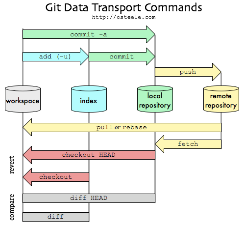

#Git Principle 👀

 

 ---

###*branch Kinds*
remote(Git), ref(History같은 저장소?), local(본인PC)

###*인덱스*
하나의 바이너리 파일이며, 각 파일과 디렉토리의 Path Name, Permission, Blob객체(SHA-1)를 포함

###*명령어*
> Init -> git init
>   >깃이 버전을 관리할 수 있도록 초기화시키는 명령어

> Status -> git status
>   >로컬 파일, 인덱스가 가리키는 파일을 비교하여 add에 해당하는 리스트  
인덱스 파일, 최신 커밋의 파일을 비교하여 commit에 해당하는 리스트를 표시  
changes to be committed, changes not staged for commit, nothing to cimmit으로 상태전달

> Add -> Git Object(blob) -> git add <파일명>
>   >인덱스의 내용과 추가 및 변경된 내용을 비교하여 반영시키는 명령어

> Commit -> Git Object(blob, tree(트리, blob파일명), commit)  -> git commit -m <메시지>
>   >Git Add를 진행하지 않고 Git Commit을 바로 진행하더라도 Add 기능을 수행하여  
인덱스에 파일상태를 기록한다(스테이징)

> Push -> git push <원격저장소명> <브랜치명>
>   >지정된 원격 저장소 브랜치에 로컬에서 commit한 내용을 push

