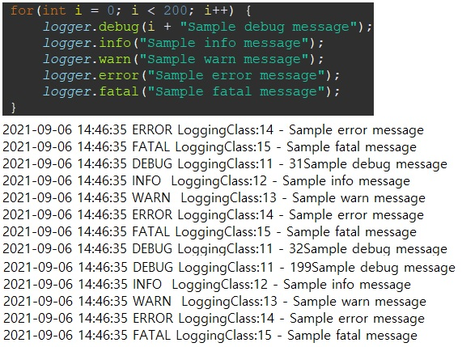

#Logging Framework

Log : 런타임에 시스템 상태를 나타내는 특정방법을 의미

종류 : SLF4J, Log4j(1,2), Logback  

>SLF4J (Simple Logging Facade For Java)
>   >logger의 추상체로 통일성있게 logging Framework들의 전환을 도와주는 역할
---
>Log4j
>   >Apache사의 Java기반 Logging Framework로 콘솔 및 파일형태로 로깅  
> 구성파일은 XML, Properties 사용 가능
---
>Logback
>   >Log4j보다 성능이 우수하며 향상된 필터링 및 리로딩(서버 재시작 X) 지원  
> springboot web안에 logging으로 Logback이 포함
---
>Log4j2
>   >Apache Logging Framework의 최신버전으로 필터링, 리로딩 기능 지원  
> Log4j2의 가장 큰 장점은 멀티스레드 환경에서 10배정도의 처리량, 적은 GC 부하  
> 참고사항으로 일반적으로 SLF4J와 함께 사용

###핵심객체
Logger(최상위 객체) : Logger 객체를 제공, 로깅 정보, 네임스페이스 계층 저장

    Java 클래스와 1:1로 Logger 생성  
    Logger 클래스의 객체를 얻으려면 객체를 반환 유형으로 제공하는 정적 팩토리 메서드를 호출  
    ex)static Logger logger = Logger.getLogger(Log4j를 사용할 해당 클래스)  

Appender(하위계층구성요소) : 콘솔, 파일, DB 등과 같은 다양한 대상에 로깅 정보를 게시하는 역할

    Appender 종류  
        FileAppender : 로그이벤트를 파일에 추가  
            RollingFileAppender : 특정 크기에 도달하면 로그 파일을 백업, 해당클래스를 확장  
            DailyRollingFileAppender : 기간설정의 로그 파일 백업  
                주의사항으로 DailyRollingFileAppender 사용시 DatePattern 설정정보를 File 설정정보 아래에 설정할 것  
        ConsoleAppender : layout의 설정을 사용하여 System.err 또는 (default)System.out에 로그 이벤트를 추가  
        JDBCAppender : DB  
        SMTPAppender : 오류와 같은 특정 이벤트가 발생했을 때 이메일전송  
        SocketAppender : 원격저장소
        SyslogAppender: 원격 Syslog 도메인에 메시지를 연결    
        TelnetAppender: 읽기 전용 소켓에 사용  
        WriterAppender: 사용자의 선택에 따라 Writer 또는 OutputStream에 로그 이벤트를 추가하는 데 사용  

Layout : 로깅 정보의 형식을 지정하는데 사용되ㅑ는 레이아웃 객체를 제공, 로깅정보 게시 전 Appender에 지원

    SimpleLayout : Level-log Message  
    PatternLayout : 설정패턴을 기반으로 로그 출력  
    HtmlLayout : HTML 테이블로 형식화  
    XMLLayout  

###지원객체

    Level Object : 우선순위, 세부정보, 정밀도를 정의하며 7가지의 Level로 관리할 수 있다
    Filter Object : 분석 및 기록 여부에 대한 추가 설정
    ObjectRenderer : 문자열타입이아닌 객체타입에 대한 로깅처리를 위한 인터페이스
    LogManager : 로깅 프레임워크 관리기 시스템 구성 파일, 클래스에서 매개변수를 읽는 데 사용


###pattern option

    %logger{length}	        : logger name을 표시하는데 %logger(10)이면 10글자 알아서 축약해서 보여줌 &#160;&#160;&#160;&#160;&#160;ex) lims.req.service.Impl.RequestMServiceImpl
    %thread			: thread name print
    %-5level 		: log level print -5는 고정 출력폭임 ex) [debug ], [trace] debug4글자 + 빈칸1 추가됨
    %msg 			: log message
    %n 			: new line (줄바꿈)
    ${PID:-} 		: process id(PID) print
    %d 			: log time print ex) %d{YYYY-MM-dd HH:mm:ss} -> 2021-03-26 12:30:11
    %p 			: logging level. 위에 %level이랑 똑같음
    %F 			: 로깅이 발생한 프로그램 파일명
    %M 			: 로깅일 발생한 메소드의 이름
    %l 			: 로깅이 발생한 호출지의 정보
    %L 			: 로깅이 발생한 호출지의 라인 수
    %t 			: thread name print
    %c 			: 로깅이 발생한 카테고리
    %C 			: Class name print
    %m 			: 로그 메시지
    %r 			: 애플리케이션 시작 이후부터 로깅이 발생한 시점까지의 시간

### Log Level

    OFF                     : 가장 높은 순위, 로깅 해제(Log4j 2버전)
    FATAL			: 조기 종료를 유발하는 심각한 오류
    ERROR			: 런타임 오류, 예기치 않은 조건
    WARN			: 오류에 가까운 경고(Log4j 2버전에서 사용안함)
    INFO			: 런타임 이벤트 (응용프로그램을 실시간으로 관리자가 확인하기 위한 용도)
    DEBUG			: 시스템에 대한 흐름의 상세정보 (개발 시 많이 사용)
    TRACE			: 상세한 정보
    ALL                     : 모든 정보

### Console 및 File로 Logging 테스트 시 설정했던 XML 파일
```xml
<?xml version="1.0" encoding="UTF-8"?>
<!DOCTYPE log4j:configuration PUBLIC "-//APACHE//DTD LOG4J 1.2//EN" "log4j.dtd">
<!-- 콘솔 기본 설정 -->
<log4j:configuration debug="true" xmlns:log4j="http://jakarta.apache.org/log4j/">
	<appender name="console" class="org.apache.log4j.ConsoleAppender">
		<layout class="org.apache.log4j.PatternLayout">
			년월일 시분초의 형식-로그레벨-클래스명-호출라인수-로그메시지-줄바꿈의 형식으로 만들어 달라는 패턴
			<param name="ConversionPattern" value="%d{yyyy-MM-dd HH:mm:ss} %-5p %c{1}:%L - %m%n" />

			<!-- 인코더 사용 가능
		        <encoder>
			        <charset>UTF-8</charset>
		        	<Pattern>${layoutPattern}</Pattern>
		        </encoder>
	        -->
		</layout>
	</appender>

	<appender name="file" class="org.apache.log4j.RollingFileAppender">
		<!-- append = false : 작성되어있는 로그 삭제 후 로그 추가, true : 기존파일에 로그 추가 -->
		<param name="append" value="true" />
		<!-- 파일용량 제한  -->
		<param name="maxFileSize" value="10KB" />
		<!-- value에 세팅되어있는 개수까지 파일을 만들 수 있으며 초과될 경우 오래된 log는 삭제되며 최근 log가 찍히는 방식 -->
		<param name="maxBackupIndex" value="5" />
		<!-- 파일생성 -->
		<param name="file" value="./logs/myLogFile.log" />
		<layout class="org.apache.log4j.PatternLayout">
			<param name="ConversionPattern" value="%d{yyyy-MM-dd HH:mm:ss} %-5p %c{1}:%L - %m%n" />
		</layout>
	</appender>

	<root>
		<level value="DEBUG" />
		<appender-ref ref="console" />
		<appender-ref ref="file" />
	</root>
</log4j:configuration>
```

####appender의 param에 설정된 maxBackupIndex가 초과 될 경우
    31번부터 199번의 로그만 남아있고 오래된 log는 삭제되어있다.
  
