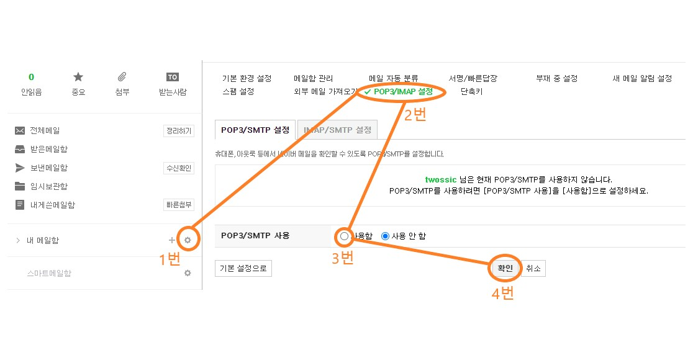
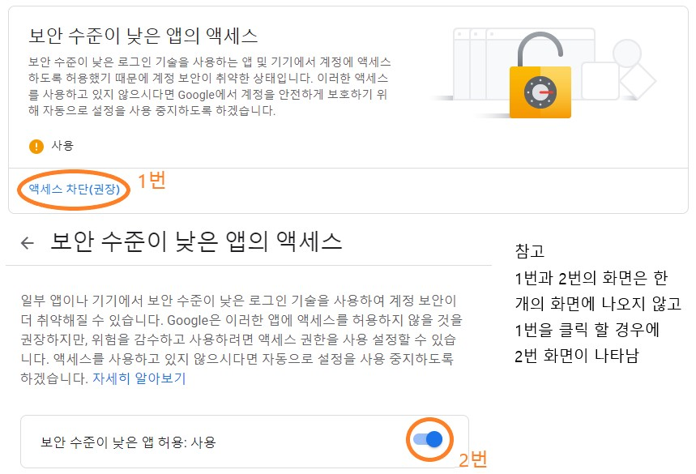
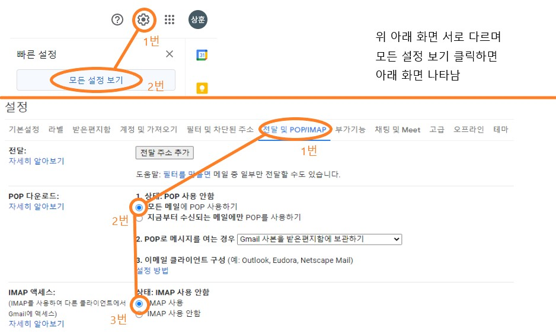

##Mail

    MUA(Mail User Agent) : 메일을 작성하여 보내는 프로그램
    MTA(Mail Transfer Agent) : 이용자에게 메일을 받아서 외부로 전달하는 프로그램
    MDA(Mail Delivery Agent) : 전송받은 메일을 해당 사용자에게 전달
    SMTP(Simple Mail Transfer Protocol) : 메일을 보낼 때 사용되는 프로토콜
    POP(Post Office Protocol) : 메일을 전송받을 때 사용되는 프로토콜
    IMAP(Internet Mail Access Protocol) : 메일을 전송받을 때 사용되는 프로토콜

###JAVA Mail
```java
import javax.mail.*;
import javax.mail.internet.InternetAddress;
import javax.mail.internet.MimeMessage;
import java.util.Properties;

public class MailTest {

    String host, user, password, toUser, port;
    public String getHost() { return host; }
    public void setHost(String host) { this.host = host; }
    public String getUser() { return user; }
    public void setUser(String user) { this.user = user; }
    public String getPassword() { return password; }
    public void setPassword(String password) { this.password = password; }
    public String getToUser() { return toUser; }
    public void setToUser(String toUser) { this.toUser = toUser; }
    public String getPort() { return port; }
    public void setPort(String port) { this.port = port; }

    public MailTest(String host, String user, String password, String toUser, String port) {
        this.host = host;
        this.user = user;
        this.password = password;
        this.toUser = toUser;
        this.port = port;
    }

    public void sendMail() {
        Properties props = new Properties();
        props.put("mail.smtp.host", host);
        props.put("mail.smtp.auth", true);
        props.put("mail.smtp.port", port);
        //google의 경우 props 추가
        if("465".equals(port)) {
            props.put("mail.smtp.ssl.enable", "true");
            props.put("mail.smtp.ssl.trust", host);
        }

        Session session = Session.getDefaultInstance(props, new javax.mail.Authenticator() {
            protected PasswordAuthentication getPasswordAuthentication() {
                return new PasswordAuthentication(user, password);
            }
        });

        try {
            MimeMessage message = new MimeMessage(session);
            message.setFrom(new InternetAddress(user));
            message.addRecipient(Message.RecipientType.TO, new InternetAddress(toUser));

            //수신자가 여러명의 경우(addRecipient : x, addRecipients : o)
            //InternetAddress[] internetAddressArray = new InternetAddress[x];
            //addArray[0] = new InternetAddress("toUser1@mail.com");
            //addArray[1] = new InternetAddress("toUser2@mail.com");
            //message.addRecipients(Message.RecipientType.TO, internetAddressArray);

            message.setSubject("This is Subject.");
            message.setText("This is Contents");

            Transport.send(message);
            System.out.println("Success Message Send");
        } catch(MessagingException e) {
            e.printStackTrace();
        }
    }

    public static void main(String[] args) {
        //네이버
        MailTest naverMt = new MailTest("smtp.naver.com", "fromUser@mail.com", "password", "toUser@mail.com", "587");
        //구글
        MailTest googleMt = new MailTest("smtp.gmail.com", "fromUser@mail.com", "password", "toUser@mail.com", "465");
    }
}
```
---
*** 주의사항  
JavaMail API (compat) maven 받을 시 This artifact was moved to: javax.mail » javax.mail-api  
JavaMail API JAR의 maven 페이지로 이동하는데 해당 라이브러리를 maven 으로 받고 테스트 시  
java.lang.NoClassDefFoundError: com/sun/mail/util/MailLogger 발생하여 아래 maven으로 해결  
```maven
    <dependency>
        <groupId>com.sun.mail</groupId>
        <artifactId>javax.mail</artifactId>
        <version>1.6.1</version>
    </dependency>
```
---
###테스트 진행 전 메일서버 User의 POP/IMAP 설정

    NAVER


    Google
시작점 : Google 계정 관리 - 보안

시작점 : Gmail - 설정
