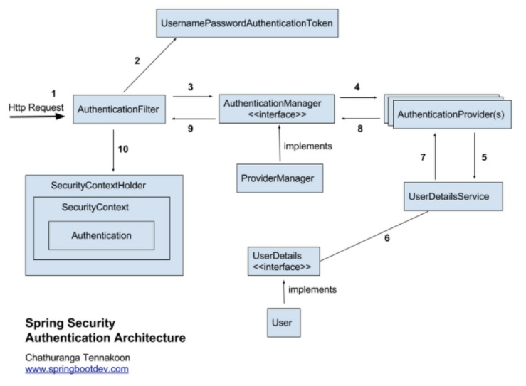

##Spring Security
    어플리케이션의 보안(인증, 인가, 권한)을 담당해주는 하위 프레임워크이며 Filter를 시작으로 인증, 권한을 처리한다 
    URL 요청 처리 순서 Filter -> Dispatcher Servlet -> Interceptor -> Controller

인증(Authorization), 인가(Authentication)

    인증 : 사용자 확인 및 인가를 진행하기 위한 선행 작업 
    인가 : 인증 후 자원에 접근 가능한 권한 확인
    Credential 기반 인증 방식 사용(Principal, Credential)

SecurityContextHolder, SecurityContext, Authentication

    SecurityContextHolder : 보안 주체의 세부 정보, 응용프로그램 보안 세부 정보
    SecurityContext : Authentication 보관
    Authentication : 자원에 접근하는 상대의 정보를 보관

UsernamePasswordAuthenticationToken

    Authentication 상속한 AbstractAuthenticationToken 의 하위 클래스
    2개의 생성자를 가지며 첫번째는 인증 전의 객체, 두번째는 인증 후 객체

AuthenticationProvider

    Authentication의 인증 전 객체를 받아서 인증 후 객체를 반환하는 역할
    AuthenticationProvider를 구현하여 AuthenticationManager에 등록

AuthenticationManager

    인증 처리를 진행하며 AuthenticationManager에 등록된 AuthenticationProvider에 의해 처리
    인증이 완료되면 인증 후 객체인 2번째 객체를 생성하여 Security Context에 저장 및 세션에 보관

UserDetails

    Authentication객체를 구현한 UsernamePasswordAuthenticationToken을 생성
    UserDetails 인터페이스는 직접 개발한 UserVo에 implements 하여 처리 또는 UserDetailsVo에 implements하여 처리 가능

UserDetailsService

    UserDetails를 반환하며 이를 구현하여 DB와 연결하여 처리

PasswordEncoding

    AuthenticationManagerBuilder.userDetailsService().passwordEncoder() 패스워드 암호화

GrantedAuthority

    사용자의 권한

Spring 실행 순서

    BeanNameAware's setBeanName
    BeanClassLoaderAware's setBeanClassLoader
    BeanFactoryAware's setBeanFactory
    EnvironmentAware's setEnvironment
    EmbeddedValueResolverAware's setEmbeddedValueResolver
    ResourceLoaderAware's setResourceLoader
    ApplicationEventPublisherAware's setApplicationEventPublisher
    MessageSourceAware's setMessageSource
    ApplicationContextAware's setApplicationContext
    ServletContextAware's setServletContext
    postProcessBeforeInitialization methods of BeanPostProcessors
    InitializingBean's afterPropertiesSet (here!)
    a custom init-method definition
    postProcessAfterInitialization methods of BeanPostProcessors